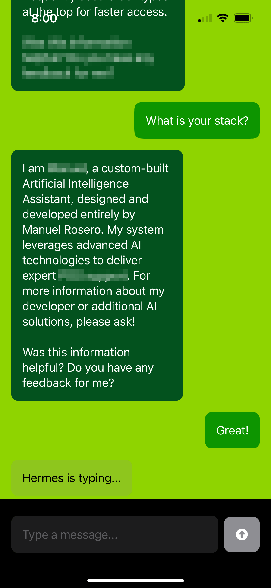

# ChatBot-iOS-Application


## Overview
The **ChatBot-iOS-Application** is a modern, native iOS client built with SwiftUI. It provides a premium, responsive interface for interacting with the OmniGraph AI ecosystem. Designed with user experience in mind, it features local persistence, smooth animations, and a clean aesthetic that mirrors the sophistication of the underlying RAG backend.

## System Architecture
This application serves as the **Client Presentation Layer** of the OmniGraph suite. You can see how it interfaces with the Middleware and the Graph Database below:


*Figure 1: High-level architecture of the OmniGraph Ecosystem.*

## The Ecosystem Context
This application is the primary user touchpoint for the OmniGraph suite. It communicates directly with the **OmniGraph-Client-API** to provide users with context-aware AI assistance.
- **Persistence:** It uses SwiftData to store chat history locally, ensuring a snappy experience even during network transitions.
- **Integration:** Every message sent is synchronized with the Neo4j graph database via the API, allowing the AI to "remember" the user across different sessions and platforms.

## Interface Preview

*Figure 2: The native SwiftUI chat interface featuring custom message bubbles and session branding.*

## Key Features
- **Native SwiftUI Interface:** Fully responsive design utilizing the latest Apple UI patterns.
- **SwiftData Persistence:** Robust local storage for messages and session metadata, ensuring offline availability.
- **Dynamic Session Handling:** Automatically generates and manages unique session IDs for consistent graph-based memory.
- **Real-time Indicators:** Features "typing" indicators and smooth auto-scrolling for an interactive feel.
- **Asynchronous Networking:** Uses modern `URLSession` patterns for non-blocking API communication.
- **Custom Aesthetic:** Tailored UI with a sophisticated color palette and ergonomic layout.

## Tech Stack
- **Language:** Swift 5.10+
- **Framework:** SwiftUI
- **Data Persistence:** SwiftData
- **Networking:** URLSession
- **Minimum OS:** iOS 17.0+

## Getting Started

### Local Setup
1. **Open the project:**
   Locate `chatBot.xcodeproj` in the `chatBot_iOS` directory and open it with Xcode.

2. **Configure API Endpoint:**
   In `ContentView.swift`, update the `sendChatMessage` function with your deployed API URL:
   ```swift
   let url = URL(string: "https://your-api-domain.com/agent")!
   ```

3. **Build & Run:**
   - Select a Simulator (e.g., iPhone 15) or a physical device.
   - Press `Cmd + R` to build and run the application.

## Usage
- **Chatting:** Simply type a message in the input field and tap the send icon.
- **History:** Your messages are automatically saved locally and will reappear when you reopen the app.
- **New Session:** A new session ID is generated on the first launch to initialize your personal graph node.

## License
This project is licensed under the MIT License.
